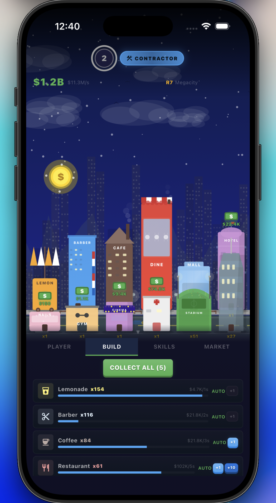

# Tap City

An idle city builder tap game built with Flutter and CustomPainter — no game engine required.

Tap to earn, buy buildings, collect income on timers, hire managers, level up, learn skills, prestige for City Stars, and grow your city skyline.

## Screenshots

<p align="center">
  
</p>

## Features

- **12 Unique Buildings** across 2 rows — from Lemonade Stands to Space Centers
- **Timer-Based Income** — Adventure Capitalist-style production cycles
- **Combo System** — rapid taps build up to a 3x multiplier
- **Managers** — hire them to auto-collect building income
- **Player Levels** — spend coins to boost tap power (up to level 50)
- **Skills** — per-run upgrades: Tap Power, Tap Income, Combo Duration, Speed Boost
- **Prestige System** — reset for City Stars with 10 civic ranks (Resident → Visionary)
- **Star Shop** — permanent cross-run upgrades bought with stars
- **Achievements & Daily Rewards** — 10 achievements with real rewards + 7-day streak
- **Golden Coin Events** — random 10x bonus taps
- **Offline Earnings** — earn while away with diminishing returns
- **All Canvas-Drawn Visuals** — buildings, smoke, cars, clouds, parallax mountains
- **Synthesized Audio** — tap clicks, coin clinks, ambient city loop, prestige arpeggios

## Tech Stack

- **Flutter** (Dart) — single-file architecture (`lib/main.dart`)
- **CustomPainter** — all city visuals drawn on canvas
- **audioplayers** — synthesized WAV sound effects
- **shared_preferences** — save/load with version migration

## Getting Started

```bash
# Clone
git clone https://github.com/tunahanyazarinsider/tap_game.git
cd tap_game

# Install dependencies
flutter pub get

# Run on iOS Simulator
flutter run -d ios

# Run on Chrome
flutter run -d chrome

# Run on Android
flutter run -d android
```

## License

All rights reserved.
